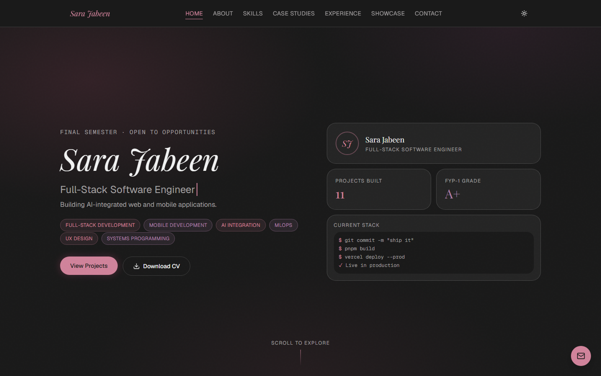
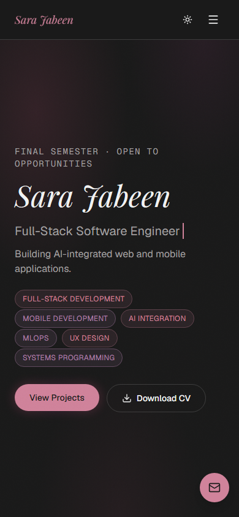

# Sara Jabeen — Portfolio

[](https://github.com/sara-jabeennn/sara-jabeen-portfolio/actions/workflows/ci.yml)

**Live:** [sara-jabeen-portfolio-swart.vercel.app](https://sara-jabeen-portfolio-swart.vercel.app/)

A personal portfolio built to showcase full-stack, mobile, and MLOps project work —
eleven real projects (final year project down to coursework), a working contact
form, and a design system built from scratch rather than a template.

## Screenshots

| Desktop | Mobile |
|---|---|
|  |  |

## Stack

| | |
|---|---|
| Framework | [Next.js](https://nextjs.org) 16 (App Router) + React 19 + TypeScript (strict) |
| Styling | [Tailwind CSS v4](https://tailwindcss.com), hand-built components, Playfair Display + Geist via `next/font` |
| Motion | [Framer Motion](https://motion.dev) — the only animation library used, scoped everywhere to respect `prefers-reduced-motion` |
| Primitives | [shadcn/ui](https://ui.shadcn.com), scoped strictly to Radix-backed components that need real focus-trap/keyboard/ARIA behavior (dialog, command palette, dropdown, tooltip, sheet, form inputs) — every other component, especially anything carrying visual identity (cards, hero, nav), is hand-built, not shadcn |
| Forms / email | React Hook Form + Zod (validated both client and server-side) → [Resend](https://resend.com) |
| Icons | Lucide React + Simple Icons (tech-stack logos) |
| Testing | Vitest + React Testing Library, Playwright, `@axe-core/playwright` (zero-violations gate on every route) |
| Deployment | Vercel, auto-deploy from `main` |

Why this stack: Next.js App Router + Vercel gives the fastest path from commit to a
production URL with proper caching and edge rendering out of the box; Tailwind v4 +
hand-built components keep the design system consistent instead of visibly
templated; Framer Motion is the one animation dependency instead of several
overlapping ones; Zod gives one schema shared between the client form and the
server route, so validation can't drift between the two.

## Local setup

```bash
pnpm install
cp .env.example .env.local   # fill in RESEND_API_KEY, CONTACT_TO_EMAIL, GITHUB_TOKEN
pnpm dev                     # http://localhost:3000
```

Other scripts:

```bash
pnpm typecheck   # tsc --noEmit
pnpm lint        # eslint
pnpm build       # next build
pnpm test        # vitest run
pnpm test:e2e    # playwright test
```

`.github/workflows/ci.yml` runs all of the above (typecheck, lint, build, unit
tests, e2e + accessibility tests) on every push and PR to `main`.

## Architecture & decisions

This project is documented as it's built, not after the fact.
[`CLAUDE.md`](./CLAUDE.md) is the single source of truth: real content (bio,
project roster, GitHub links), the locked design system (palette, fonts, hard
rules), and a running decisions log explaining *why* things changed — including
reversed decisions and mistakes that got caught and corrected, not just the final
state. `docs/` holds prior planning material for reference; `CLAUDE.md` wins on
any conflict.

All content — projects, skills, experience, socials, showcase entries, stats —
lives in `data/*.ts`, typed against `types/*.ts`. Adding or editing a project
never requires touching a component.

## License

Personal portfolio — content and code are not licensed for reuse.
